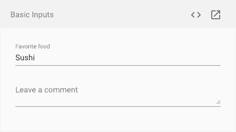

# Components
## ¿Qué es un componente?

La palabra de moda en Frontend desde hace unos cuantos años. El término "componente" hace referencia a una pieza de código HTML, JS y CSS que se puede reutilizar y utilizar por separado cuando queramos. Gracias a distintos estándares como [Custom Elements](https://developer.mozilla.org/en-US/docs/Web/API/Window/customElements), el tag [template](https://developer.mozilla.org/es/docs/Web/HTML/Elemento/template) y en menor medida el [Shadow Dom](https://developer.mozilla.org/en-US/docs/Web/Web_Components/Using_shadow_DOM), podemos asegurarnos de crear piezas de código que no afectan al resto de la web ni al resto de componentes, pudiendo de esta forma desarrollar piezas aisladas sin preocuparnos de tener conflictos con el resto de desarrollos.

 A continuación podemos ver un ejemplo de un componente Input de [Angular Material](https://material.angular.io/components/input/overview)

Un componente puede tener distinta granularidad. Puede ser un componente botón, un componente input, un componente buscador con un botón o un input, o una página completa que utilice todos los anteriores. Si te cuesta entender este concepto, puedes empezar leyendo [este artículo de brad frost](http://bradfrost.com/blog/post/atomic-web-design/) en el que habla del Atomic Design, un referente en cuanto al desarrollo de componentes.

De esta forma, no desarrollaremos páginas como tal, si no que compondremos páginas con los componentes desarrollados. 

Además de componentes, Angular tiene otros componentes claves, como servicios y directivas, pero hablaremos de ellos más adelante. Lo primero que tienes que tener claro son los conceptos anteriores.

