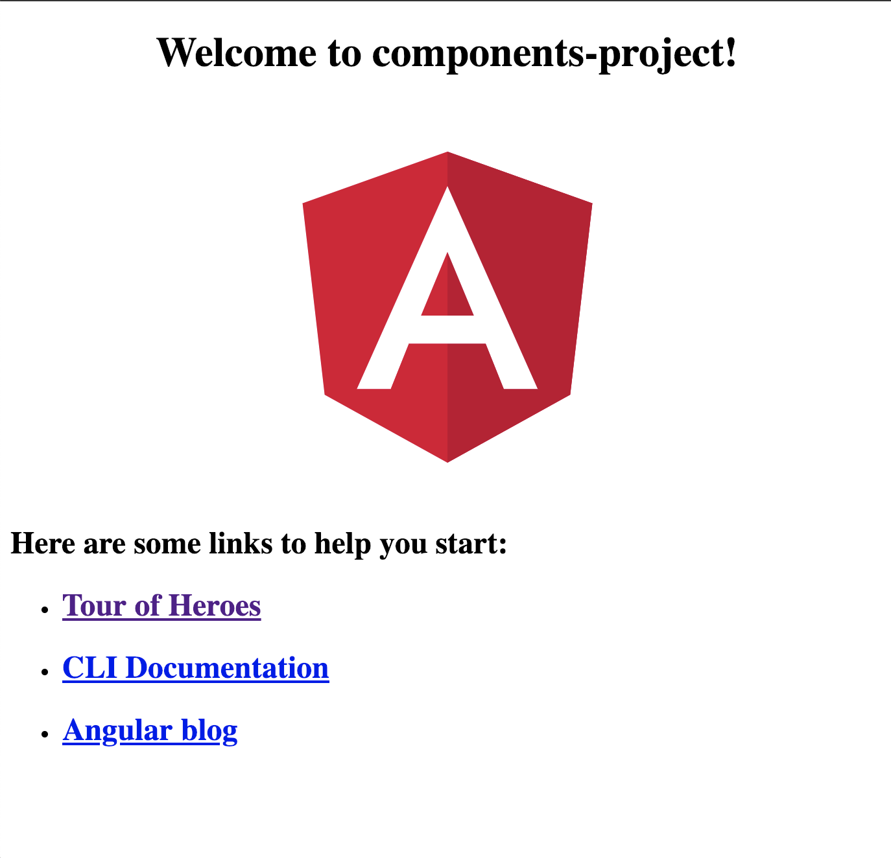

# Angular Components

## Creando un primer proyecto

Ahora que sabemos lo que es un componente, puedes entrar en materia con los componentes de Angular. Para **crear tu primer componente**, vas a utilizar la herramienta que te acompañará a lo largo de tu aprendizaje con este framework, el [Angular CLI](https://cli.angular.io/). Si quieres más info, puedes visitar el capítulo para este cli. De momento vamos a ir lo con lo básico. Vamos a empezar instalando el cli y creando un nuevo proyecto.

```BASH

npm install -g @angular/cli

ng new components-project

cd components-project
```

Al hacer **ng new**, nos aparecerán una serie de opciones para ver como queremos la **configuración inicial de nuestro proyecto**. El CLI es una herramienta super interesante que  veremos más adelante. Cuando hagamos un create nos dará opciones para añadir routing a nuestra aplicación, y la opción de seleccionar un preprocesador por defecto de CSS De momento vamos a optar por las opciones más básicas, **sin routing, y con CSS simple**.

Una vez tengamos el proyecto creado y estemos dentro del directorio, podemos lanzar la aplicación con el comando **ng serve**

```
ng serve
```

Este comando, lanzará a través de webpack un servidor local en la dirección [localhost:4200](http://localhost:4200) donde podremos observar nuestra primera aplicación Angular. Así mismo, el cli se ocupará por nosotros de transformar todo ese Typescript en Javascript antes de que llegue al navegador. Si accedemos veremos lo siguiente



## Componentes en Angular

Esto que vemos es el componente inicial o root de la aplicación, que por defecto, se llamará **app-component**. 

*Ten en cuenta que los web components requieren siempre un nombre con guión medio para evitar conflictos de nombre con elementos nativos de HTML*

Antes de seguir voy a intentar explicarte como funcionan los componentes de Angular. **Los componentes siempre van a tener un módelo que separan la vista y la parte lógica.** Relacionándolo con los tipos de archivo, cada componente va a tener, mínimo, un archivo Typescript y otro HTML. **Todas las variables, valores y funciones, que declaremos en nuestra clase Typescript, van a ser accesibles e invocables desde nuestro código HTML**.

Ahora deberías abrir tu IDE favorito (si no tienes uno, VSCode es una buena opción ahora mismo) y abrir la carpeta components-project que se ha generado. Aquí vamos a navegar entre los distintos archivos y demás (que explicaremos más adelante) y vamos a abrir directamente el src/app/app.component.html y eliminar parte de el contenido para dejarlo con lo siguiente. Voy a aprovechar para intentar explicar mejor el anterior punto

```HTML
<!-- app.component.html -->
<div style="text-align:center">
  <h1>
    <!-- 
        Con esta sintaxis {{ }} puedo coger 
        un valor de la clase definida debajo y pintarlo
        en este espacio 
    -->
    Welcome to {{ title }}!
  </h1>
</div>
```

y nuestro app.component.ts, que definirá los valores que pintamos en nuestro componente.

```TS
import { Component } from '@angular/core';

@Component({
  // en el selector, le indico el tag que voy a crear,
  // de esta forma, podré utilizarlo en el html con <app-root>
  selector: 'app-root',
  // Aquí definimos la ruta del html 
  // que queremos utilizar para este componente
  templateUrl: './app.component.html',
  // Aquí definimos la ruta del css 
  // que queremos utilizar para este componente. Al ser un
  // array, podemos introducir varios archivos css.
  styleUrls: ['./app.component.css']
})
/* 
*   Es una clase como la que hemos visto en ES6 y TS,
*   que define una propiedad, en este caso title,
*   que se utiliza en el template con la sintaxis {{ }} 
+   para mostrar su valor
*/
export class AppComponent {
  title = 'components-project';
}
```

Un componente de Angular tiene 2 partes principales. Una es la clase que define las propiedades y comportamientos del mismo, que estará definida en el *app.component.ts*. Y la otra es precisamente el template del componente. En Angular, un componente **debe tener siempre una parte visual.** Si queremos desarrollar simplemente lógica o funcionalidad, deberemos definirla en otro tipo de elemento, como puede ser un servicio.

Como se puede ver en los fragmentos del código anterior, Angular opta por una modificación del DOM a través de su propia sintaxis y referencias, por lo que es conveniente dejar a un lado el pensamiento de modificar nodos y elementos a través de querySeletor y demás herramientas del navegador.

Vamos a generar un nuevo componente para utilizar desde este app-component.