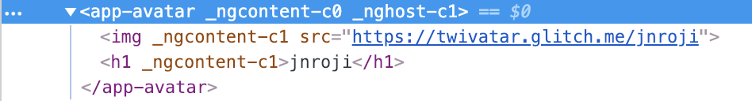

# Creando nuestro primer componente

## Generando desde el cli

El cli de Angular nos permite **generar los distintos elementos desde el terminal** de forma cómoda. Para hacerlo, vamos a utilizar el siguiente comando

```BASH
ng generate component avatar
# o abreviado
ng g c avatar

# Puedes utilizar este comando para obtener información
# sobre los tipos de elementos que se pueden generar
ng g --help
```

Si ejecutamos esto, y volvemos a nuestro IDE, podremos ver una nueva carpeta con cuatro archivos, en orden, el template de nuestro componente, su lógica, sus estilos y su archivo para el testing unitario del componente.
* avatar.component.html
* avatar.component.ts
* avatar.component.css
* avatar.component.spec

## Componente avatar

Lo primero es lo primero. Nuestro componente Avatar ya esta creado e insertado en nuestra aplicación, pero aún no lo vemos porque no lo estamos utilizando desde nuestro app.component.

### Utilizar un componente

Para utilizar el componente, simplemente debemos añadir un tag con el selector del componente a utilizar en el HTML. Es decir, vamos a abrir el app.component.html, y añadir el selector de nuestro componente avatar.

```HTML
<!--The content below is only a placeholder and can be replaced.-->
<div style="text-align:center">
  <h1>
    Welcome to {{ title }}!
  </h1>
</div>

<app-avatar></app-avatar>
```

Todos los proyectos de angular, se crean con un *namespace*, que se utiliza en la creación de componentes para generar el selector. Este valor puede modificarse en el campo "prefix" del angular.json. Por defecto es app, por lo que el componente que hemos creado, tendrá como selector **app-avatar**. Si aún tienes dudas, o prefieres personalizar el nombre, siempre puedes ir a la definición del componente, en el avatar.component.ts, y modificar la propiedad **selector**.

Una vez añadido el selector, debería aparecer en nuestra pantalla un texto en el que se lee **avatar works!**. Este texto es el template por defecto de un componente generado por el cli de angular.

## Añadiendo propiedades
Vamos a empezar a desarrollar nuestro componente avatar abriendo el avatar.component.ts

```TS
import { Component, OnInit } from '@angular/core';

@Component({
  selector: 'app-avatar',
  templateUrl: './avatar.component.html',
  styleUrls: ['./avatar.component.css']
})
export class AvatarComponent implements OnInit {

  constructor() { }

  ngOnInit() { }

}
```

Lo primero es pensar en los valores que van a ser modificables de mi componente. Es decir, si mi componente avatar, va a representar información de un usuario, tendré que tener variables para aquellos valores sensibles de cambio. En este caso vamos a añadir un nombre de usuario.

```TS
import { Component, OnInit } from '@angular/core';

@Component({
  selector: 'app-avatar',
  templateUrl: './avatar.component.html',
  styleUrls: ['./avatar.component.css']
})
export class AvatarComponent implements OnInit {
  username: string;

  constructor() { }
  
  ngOnInit() { }
}
```

Hemos definido la variable username, pero ahora mismo no tiene valor, por lo que si la pintamos, no aparecerá nada en el template, vamos a darle un valor por defecto, y de paso, añadir otra variable para la imagen del usuario.

```TS
import { Component, OnInit } from '@angular/core';

@Component({
  selector: 'app-avatar',
  templateUrl: './avatar.component.html',
  styleUrls: ['./avatar.component.css']
})
export class AvatarComponent implements OnInit {
  username: string = 'jnroji';
  image: string = 'https://twivatar.glitch.me/jnroji';

  constructor() { }
  
  ngOnInit() { }
}
```

y por supuesto, modificar nuestro HTML para visualizar nuestro avatar

```HTML
<!-- Podemos tambien 'insertar' los valores de la clase en atributos -->

<h1>{{ username }}</h1>
```

Si recargamos la página, veremos nuestro componente avatar en pantalla. Vamos a darle unos pocos estilos para que no quede tan feo :)

```CSS
:host {
    align-items: center;
    display: flex;
    flex-direction: column;
    justify-content: center;
    padding: 12px;
}

img {
    border: 3px solid #d8d4d4;
    border-radius: 100%;
    max-width: 80px;
}

h1 {
    font-family: arial;
    font-size: 14px;
}
```

Si estáis acostumbrados a maquetar, este código igual os chirrie por varias razones. La primera, es que todos los selectores son por tag. Esto tradicionalmente trae muchos problemas a la hora de dar estilos, por que significa que todos los h1 y los img de la página van a coger estos estilos, y tendremos problemas a la hora de estilar todo. En Angular, ese problema no existe, dado que como hablamos en el capítulo anterior, el componente **encapsula los estilos, haciendo que las reglas que definamos en el css de un componente, solo afecte al HTML del mismo.** Esto nos garantiza que todos estilos solo aplicarán al componente en cuestión. 

```
Personalmente, sigo considerando una mala práctica la maquetación utilizando unicamente tags, ya que es poco específica y los tags son elementos sensibles de modificaciones, pero nos viene bien para comprender el concepto de encapsulación.
```

Además de lo anterior, os habréis fijado en un selector especial, el **:host.** Para entender a que hace referencia, vamos a explorar el DOM del componente



Como podréis observar, a diferencia de otros frameworks como React, Angular no "reemplaza" la etiqueta app-avatar con el contenido de nuestro template, si no que lo "inserta" en el. Al hacerlo, estamos dejando un nodo, el de la etiqueta app-avatar, que puede necesitar ciertos estilos en algunos momentos. Para hacer referencia a ese nodo, desde el propio componente, podemos utilizar este selector :host:. En nuestro caso, con los estilos de arriba, estamos convirtiendo el componente en un contenedor flex para poder manejar nuestro contenido de una forma más cómoda.

## Reutilizando el componente

Una vez hemos terminado de darle estilos a nuestro componente, podemos empezar a reutilizarlo. Lo bueno de este desarollo, es que una vez hemos terminado nuestro avatar, no hace falta que volvamos a crear estos estilos, ni volvamos a declarar las propiedades, podemos usar la etiqueta app-avatar, y el navegador dotará de significado esa etiqueta. Podemos probarlo en nuestro app.component.html

```HTML
<!--The content below is only a placeholder and can be replaced.-->
<div style="text-align:center">
  <h1>
    Welcome to {{ title }}!
  </h1>
</div>

<app-avatar></app-avatar>
<app-avatar></app-avatar>
<app-avatar></app-avatar>
```

De esta forma, estaremos generando 3 componentes avatar. El problema es que todos muestran el mismo usuario por que hemos escrito el valor "a fuego". Vamos a ver como podemos "pasar" esos valores al componente de forma sencilla.

